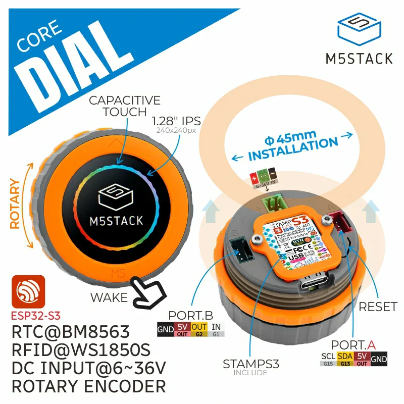
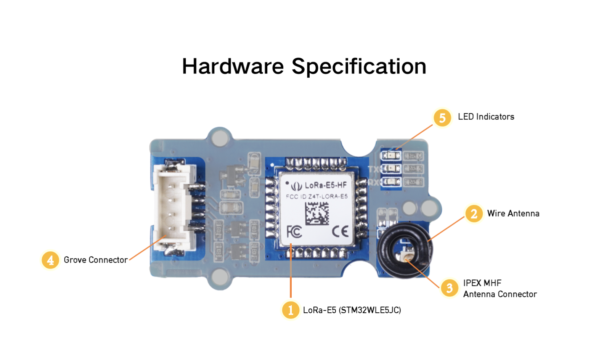
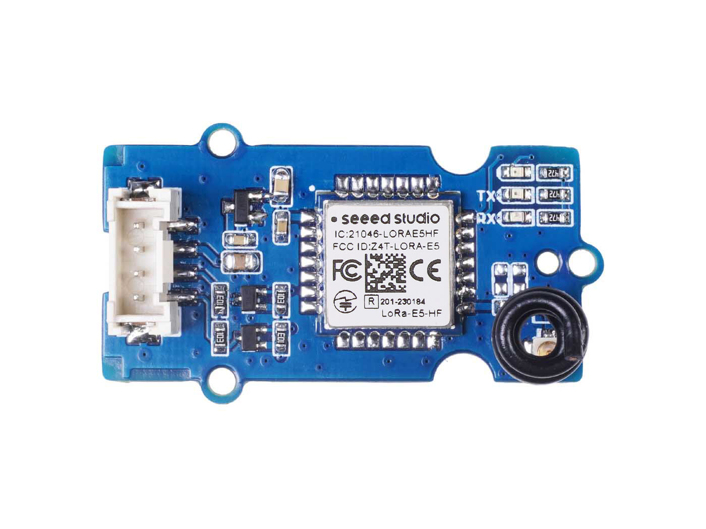
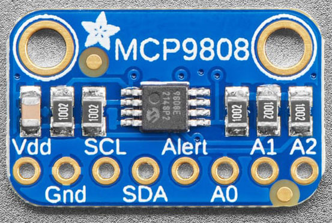

# 🌡️ M5Dial Smart Thermostat

A precision temperature control system with wireless LoRa communication for home
heating automation.

## 📚 Documentation

Complete documentation is organized into four guides:

### 🏠 [User Guide](USER_GUIDE.md)

**For end users** - Features, operation, LED status codes, and basic
troubleshooting

- Temperature display and control
- Heating operation
- Receiver LED status codes
- Power management
- Basic troubleshooting

### 🔧 [Hardware Guide](HARDWARE_GUIDE.md)

**For installation** - Pin connections, baud rates, wiring diagrams, and
technical specifications

- Complete wiring diagrams
- Pin assignments (M5Dial & XIAO)
- UART baud rate configuration (9600 - factory default)
- Grove-Wio-E5 setup
- Power requirements
- Range optimization

### 🌐 [Network Guide](NETWORK_GUIDE.md)

**For setup** - Communication modes, network configuration, and connectivity
troubleshooting

- P2P vs LoRaWAN modes
- LoRa configuration
- WiFi setup (time sync only)
- Range testing
- Communication troubleshooting
- Security considerations

### 👨‍💻 [Developer Guide](DEVELOPER_GUIDE.md)

**For developers** - Build instructions, code architecture, and development
workflow

- Development environment setup
- Build and upload procedures
- Code architecture
- Communication protocol
- Power management implementation
- Adding features

## Quick Start

### User Setup

1. Read [User Guide](USER_GUIDE.md) for operation
2. Plug in both units (M5Dial and receiver)
3. Watch receiver LED - should pulse then show steady patterns
4. Dial controls temperature, system auto-controls heating

### Hardware Setup

1. Follow [Hardware Guide](HARDWARE_GUIDE.md) for wiring
2. Connect Grove-Wio-E5 modules to both devices
3. **Current baud rate: 9600** (both devices - Grove-Wio-E5 factory default)
4. Power on, optionally check serial monitor at 115200 baud for debug messages.

### Developer Setup

1. Read [Developer Guide](DEVELOPER_GUIDE.md)
2. Install VS Code + PlatformIO
3. Copy `secrets_template.h` to `secrets.h`
4. Build and upload code & data file. NOTE: both devices must be in 'code
   upload' mode for these next steps (power them on while holding down their
   RESET buttons):
   ```bash
   pio run --target upload --upload-port COM4
   pio run --target uploadfs --upload-port COM4
   cd receiver && pio run --target upload --upload-port COM6 ; cd ..
   ```
5. Power cycle both devices within a minute or so of each other. (Other
   sequences have not been tested.)

## System Overview

**Transmitter (M5Dial):**

- Temperature monitoring (MCP9808 sensor)
- Rotary dial interface
- Wireless LoRa transmitter
- Battery or USB powered
- https://shop.m5stack.com/products/m5stack-dial-esp32-s3-smart-rotary-knob-w-1-28-round-touch-screen
  ~$23 
- https://www.seeedstudio.com/Grove-LoRa-E5-STM32WLE5JC-p-4867.html ~$16
  

**Receiver (XIAO ESP32S3):**

- Receives heating commands
- Controls relay (GPIO10)
- Status LED (GPIO9)
- Safety auto-shutoff (10 min timeout)
- https://www.seeedstudio.com/XIAO-ESP32S3-p-5627.html or similar ~$8
  
- https://www.seeedstudio.com/Grove-LoRa-E5-STM32WLE5JC-p-4867.html ~$16
  
- https://www.adafruit.com/product/1782 or other temperature sensor ~$5
  

**Communication:**

- P2P Mode (default) - Direct device-to-device
- LoRaWAN Mode (fallback) - Network infrastructure
- Automatic mode fallback for reliability

## Key Features

- ✅ Precision temperature control (±0.25°C accuracy)
- ✅ Wireless LoRa communication (100-300m indoor range)
- ✅ Automatic temperature scheduling
- ✅ Power-optimized battery operation
- ✅ Safety timeout protection
- ✅ Dual communication modes with fallback
- ✅ Visual status indicators

## Safety Features

- 🛡️ 10-minute timeout auto-shutoff
- 🛡️ Always starts with heater OFF
- 🛡️ Watchdog timer protection
- 🛡️ State verification
- 🛡️ Communication loss detection

## Hardware Requirements

- **M5Stack Dial** (ESP32-S3)
- **MCP9808** temperature sensor
- **Seeed XIAO ESP32S3**
- **2x Grove-Wio-E5** LoRa modules
- **Relay module** for heater control
- **Optional:** Status LED, battery pack

## Current Configuration

**LoRa UART Baud Rate:** 9600 (Grove-Wio-E5 factory default)  
**USB Serial Monitor:** 115200  
**Connection Timeout:** 3 minutes  
**Auto Baud Search:** Disabled (for reliable sync)

See
[Hardware Guide - UART Configuration](HARDWARE_GUIDE.md#uartserial-baud-rate-configuration)
for details.

## Support

- **Issues:** Open an issue on GitHub
- **Questions:** See documentation guides above
- **Updates:** Check for firmware updates

## License

MIT License - See [LICENSE](LICENSE) file

## Author

**John Cornelison**  
john@vashonSoftware.com  
Version 2.0.0 - January 2026

---

_Safe, efficient home heating control_ 🏠🔥
